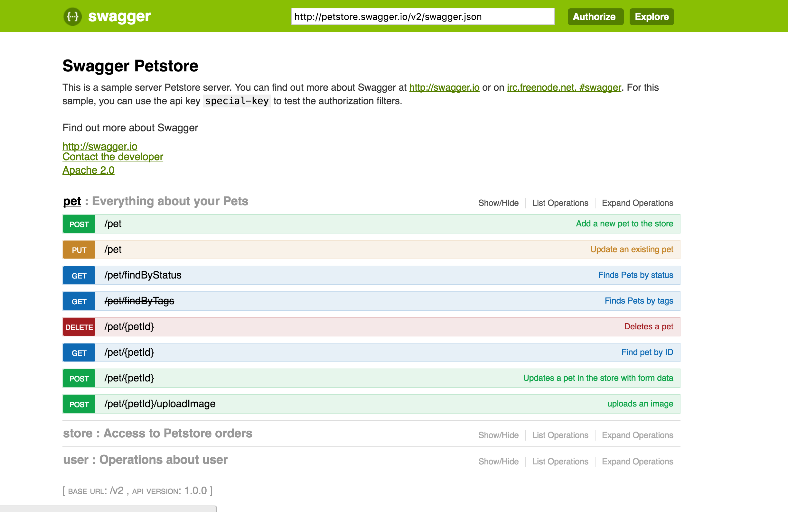

### Swagger
## The easy yet powerful framework for RESTful APIs design

---

## Agenda

1. What is Swagger
2. Swagger ecosystem demo
3. Integration with AWS Lambda demo

---

## What is Swagger

### Everything in Swagger is built around Swagger file.

- Basically a YAML/JSON file of predefined syntax
- Now incorporated to global OpenAPI specification standard
- Currently version 2.0. Versions 2.1 and 3 are in development
- Swagger is not only a syntax standard but also a set of tools to work with it

---

## An example of Swagger file

```YAML
  swagger: "2.0"
  info:
    version: "1.0.0"
    title: "Swagger Petstore"
    description: "A sample API that uses a petstore as an example to demonstrate features in the swagger-2.0 specification"
    termsOfService: "http://swagger.io/terms/"
    contact:
      name: "Swagger API Team"
    license:
      name: "MIT"
  host: "petstore.swagger.io"
  basePath: "/api"
  schemes:
    - "http"
  consumes:
    - "application/json"
  produces:
    - "application/json"
  paths:
    /pets:
      get:
        description: "Returns all pets from the system that the user has access to"
        produces:
          - "application/json"
        responses:
          "200":
            description: "A list of pets."
            schema:
              type: "array"
              items:
                $ref: "#/definitions/Pet"
  definitions:
    Pet:
      type: "object"
      required:
        - "id"
        - "name"
      properties:
        id:
          type: "integer"
          format: "int64"
        name:
          type: "string"
        tag:
          type: "string"
```

---

## Swagger Ecosystem

### Swagger consists of several core tools provided by Swagger team, and from lots of third-party open source and commercial products. This is where magic begins.

---


---

## Swagger UI

Converts Swagger file into beautiful interactive documentation available for customization.



---

## Swagger Editor
WYSIWYG web editor for YAML files

## CodeGen
Generate clients and server stubs on the fly directly from the YAML files.

## Validator
Validate your YAML/JSON files while developing

